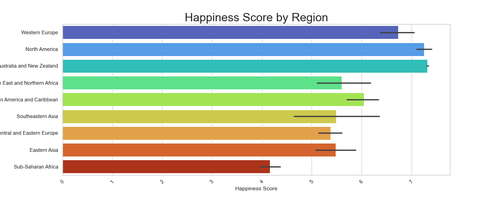

# Do happier countries drink more or less than sad countries?


   * 111 countries across 9 regions. 
   * Determine what factors make people happy?
   * How does happiness compare across the world?
   * What differences between countries cause certain countries to be happier?
   * As intermediate conclusion could be that drinking affects happiness. However, as we factor in all categories it will show us the big picture on what factors truly contribute to an individual’s happiness.

### Happiness Score by Region



  * What is Happiness score? We looked at 2 data sets from World Happiness Report and Happiness And Alcohol consumption report. 
  * A metric measured by asking sampled people the following question: "How would you rate your happiness on a 1-10 scale”...
  * As we unfold our data findings, we will examine Happiness Score to various contributors SUCH AS: Monetary influences, Alcohol and Socioeconomic factors. 
  * Australians, New Zealanders and North Americans are the Happiest people, while Sub- Saharan Africa along with Central and Eastern Europe are the least happy people.

### GDP Per Capita by Region


  * Gross domestic product (GDP) is a monetary measure of the market value of all the final goods and services produced in a specific time period
  * North America Highest and Lowest GDP Sub- Saharan African

## Diggin Deeper into the Data

  * Let’s dig deeper to find out more about happiness and why some countries are happier than others?
  * We found a dataset that included some information into what made up the Happiness Score for Countries/Regions . We merged the data to correlate with how these can possibly affect alcohol consumption .

````jupyter
top_bottom_df.groupby(["Region"]).mean().plot(kind = "pie", y = "Life Choices", autopct='%1.1f%%',figsize=(9,9), textprops={'color':"w"})
plt.ylabel("")
plt.title("Regional Freedom of Life Choices", fontsize = 20)
plt.legend(bbox_to_anchor=(1.05, 1.0), loc='upper left')
plt.tight_layout()

plt.savefig("Figures/Freedomof_life _choices.png")
plt.show
```


```jupyter
#scatter plot of gdp and happiness for all countries

#set up scatterplot
plt.figure(figsize = (15,5))
sns.scatterplot(data = happiness_sort_df, x = "GDP (Per Capita)", y = "Happiness Score", palette = "turbo", hue = "Region")
#calc regression
x_values = happiness_sort_df["GDP (Per Capita)"]
y_values = happiness_sort_df["Happiness Score"]
(slope, intercept, rvalue, pvalue, stderr) = linregress(x_values, y_values)
regress_values = x_values * slope + intercept
corr=st.pearson(x_values, y_values)[0]
print(f"the correlation is {corr:.2f}")
line_eq = "y = " + str(round(slope,2)) + "x + " + str(round(intercept,2))
plt.plot(x_values,regress_values,"r-")
plt.annotate(line_eq,(0,2),fontsize=5,color="red")
print(f"The r-squared is: {rvalue**2}")

#clean up scatter plot for looks
plt.title("Happiness Score and GDP (Per Capita) for all Countries", fontsize = 20)
plt.xlabel("Happiness Score", fontsize = 15)
plt.ylabel("GDP Per Capita", fontsize = 15)

plt.savefig("Figures/all_happy_gdp_scatter.png")
plt.show()

```


```jupyter
# top 10 data frame
top_df = happiness_sort_df.nlargest(10, "Happiness Score")
top_df
```

```jupyter

# Bottom 10 data frame
bottom_df = happiness_sort_df.nsmallest(10, "Happiness Score")
sort_bottom_df = bottom_df.sort_values("Happiness Score", ascending = False)
sort_bottom_df
```